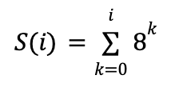

# Fractals-Drawing

A dynamic visualization of the iterations of the **Sierpinski Carpet** and **Sierpinski Triangle** fractals.\
This project represents my first attempt at a CS project following my first semester at Northeastern University, and it is implemented in **Racket**. Through this program, I attempt to use Computer Science to visualize a complex but fascinating, recursive geometrical figures, but I also worked on utilizing mathematical and discrete concepts to make the program follow the rules that will make it achieve its purpose.

 


## Installation & Usage
Download the Racket programming language `version 7.4` and IDE through this [Link](https://download.racket-lang.org).

You can start the program in two ways:
##### Command Line (UNIX)
Create a symlink to the `racket` command by running
```
ln -sf "/Applications/Racket v6.2.1/bin/racket" /usr/local/bin/racket
```
Then, access the path where your fractal simulator file is and run
```
racket sierpinski-<fractal>.rkt
```

##### IDE
You can open the desired fractal simulation file on the **DrRacket IDE** and press the run button.

#### Usage
After starting up the program, you can use your **keyboard arrows** to go through the iterations of the fractal.
* ➡️: Next iteration.
* ⬅️: Previous iteration.

To exit, simply close the GUI window.


## Implementation Details
A fractal is a recursive geometrical figure, where the figure repeats itself infinitely within itself. The Sierpinski Carpet and Sierpinski Triangle not only differ in the shapes used to generate the fractal (the former uses squares, while the latter uses triangles), but they also generate themselves in opposite ways. The Sierpinski Carpet inserting black squares infinitely until filling up the entire area, whereas the Sierpinski Triangle infinitely removes squares until we can't tell anymore that there ever was a triangle in the first place.

#### Sierpinski Carpet
Generating this fractal requires, at each iteration, to subdivide every white square present in the current iteration into 9 squares of equal sizes and turning the middle square black. This means that for every white square processed 8 white squares are generated for the next iteration. We can use this information to derive the following geometric series representing the number of white squares processed during each iteration: , where `i` is the iteration number. Calculating the number of squares that were generated during the previous iteration can help us reduce the size of the squares to process for the next iteration.

#### Sierpinski Triangle
The simulation begins with a black triangle at iteration 0. During each iteration, we subdivide every black triangle into 4 triangles of equal size, and we turn the middle triangle white. Therefore, each black triangle generates 3 black smaller triangles for the next iteration.


## Resources
* [Racket Documentation](https://docs.racket-lang.org/guide/intro.html)
* [Sierpinski Triangle](https://en.wikipedia.org/wiki/Sierpiński_triangle)
* [Sierpinski Carpet](https://en.wikipedia.org/wiki/Sierpiński_carpet)
